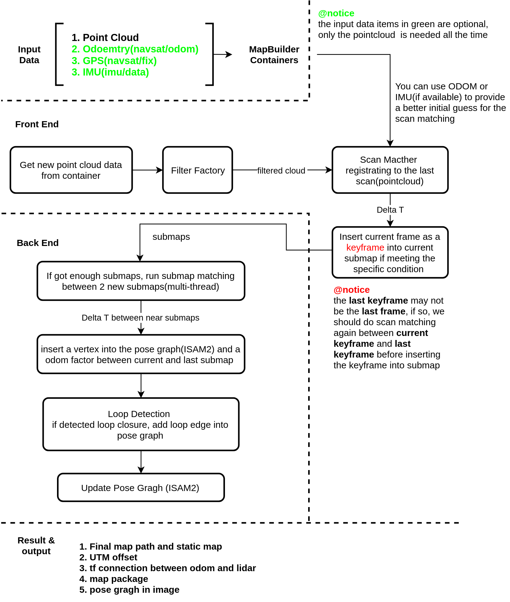
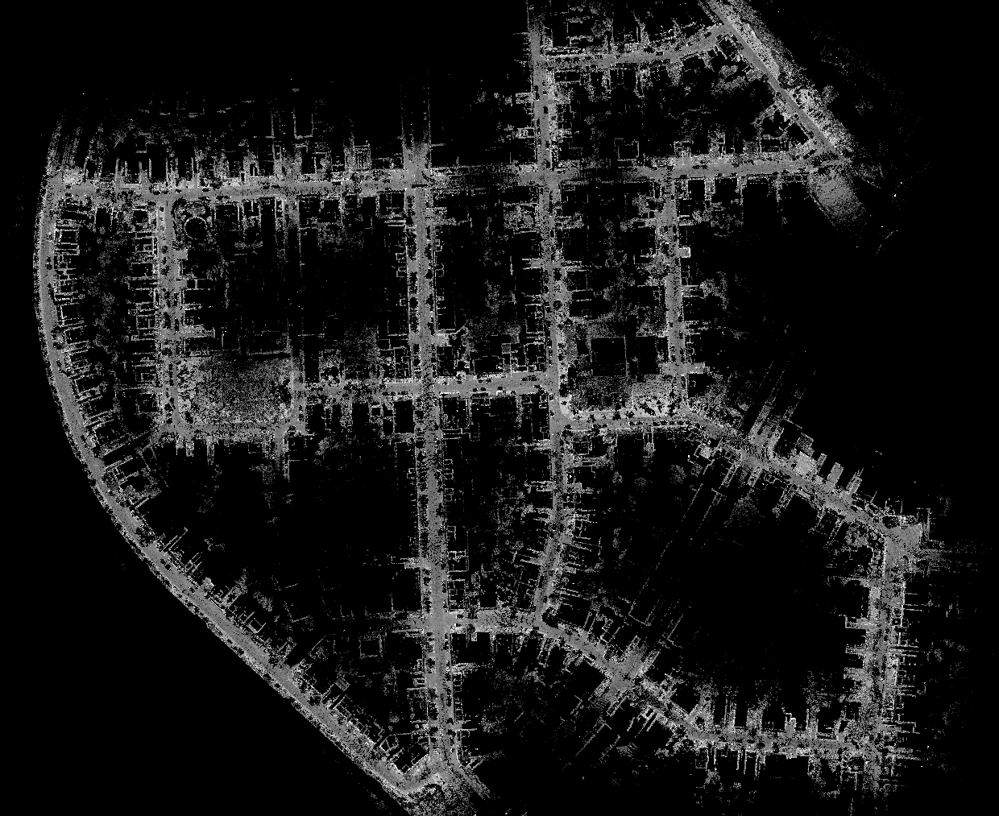
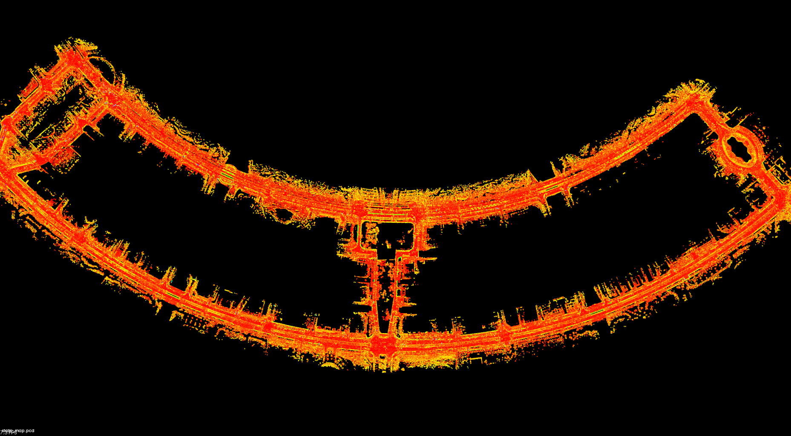
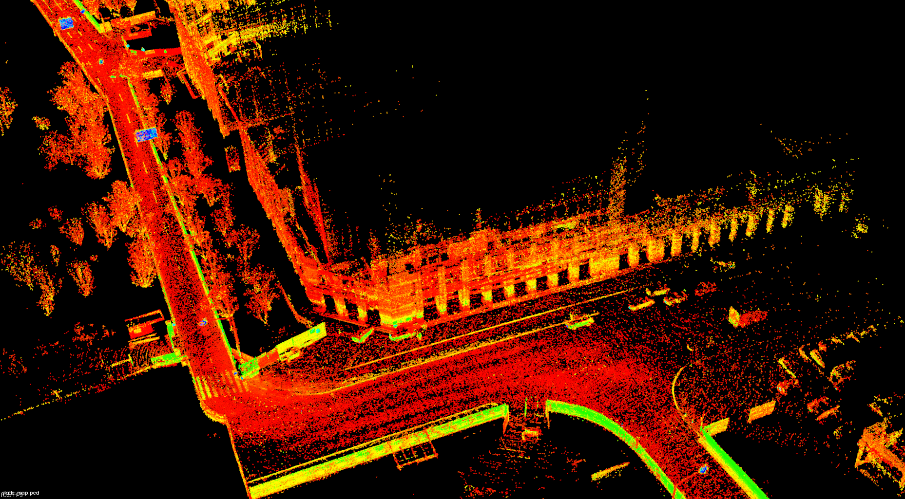
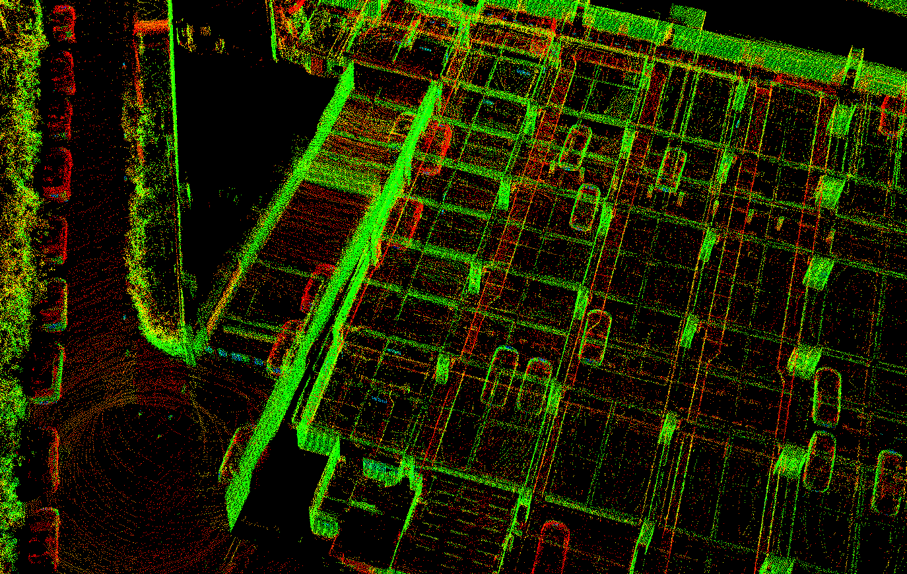

[](https://996.icu/#/en_US)
[](https://github.com/996icu/996.ICU/blob/master/LICENSE)
[](https://join.slack.com/t/996icu/shared_invite/enQtNjI0MjEzMTUxNDI0LTkyMGViNmJiZjYwOWVlNzQ3NmQ4NTQyMDRiZTNmOWFkMzYxZWNmZGI0NDA4MWIwOGVhOThhMzc3NGQyMDBhZDc)  
[中文文档](README.Chinese.md)  

# Introduction  
  

# Map with kitti dataset


# Build
> For now, It is recommended to build this repo in your host device but not in docker, due to that the docker image is not enough tested.
## Using host device
### Requirements 
> Ros should be installed in the first place, You can refer to [http://wiki.ros.org/kinetic/Installation/Ubuntu](http://wiki.ros.org/kinetic/Installation/Ubuntu) for more information for installing ROS kinetic or higher version. This repo has been tested in kinetic and melodic.

```bash
## basic depencencies
sudo apt -y install cmake \
  libboost-dev \
  libeigen3-dev \
  libpng-dev \
  libgoogle-glog-dev \
  libatlas-base-dev \
  libsuitesparse-dev \
  imagemagick \
  libtbb-dev

## install pcl 
## tested in pcl-1.7 (ubuntu16.04) and pcl-1.8 (ubuntu18.04)
sudo apt -y install libpcl-dev

cd your_own_workspace 
## like /home/user/3rd_parties
## or you can just go to "third_parties" in this repo
## GeoGraphic
./path_of_StaticMapping/setup/install_geographiclib.sh
## GTSAM(4.0 or higher is needed)
./path_of_StaticMapping/setup/install_gtsam.sh
## libnabo
./path_of_StaticMapping/setup/install_libnabo.sh
## libpointmatcher
./path_of_StaticMapping/setup/install_libpointmatcher.sh
```

### Optional libs
- **CUDA**: We have made some attempts in fasting the kdtree in ICP by creating the kdtree on GPU, but the GPU Kdtree is not fast enough(just 1.5~2 times faster than libnabo). Notice that if you use CUDA, your g++ version should be lower than 6.0 because the nvcc does not support the 6.0 or high version g++.  
- **cuda_utils**: 

### compiling
```bash
mkdir build && cd build
cmake ..
make -j8
```

## Using Docker 
If yours host device is with UBUNTU 18.04, it is highly recommended to build and run this project in a docker because the docker is `FROM ros:melodic-ros-core-bionic`. Otherwise, you can also build your envrionment directly on your device refering to **Using host device** section below. 
ps: there is something wrong with ros message sent from ros-kinetic to ros-melodic, so, it your host deice is not with Ubuntu 18.04, you can not use this docker, and the docker for ros-kinetic will come soon.
### Get docker image 
#### For China Mainland
The fastest way to get the image is pulling from aliyun if you live in mainland of China
```docker
docker pull registry.cn-hangzhou.aliyuncs.com/edward_slam/static_mapping:master_bionic_latest
```
or you can build it on your own device 
```docker
docker build --rm -t slam/static_mapping:latest . 
```

#### For somewhere else
first, remove lines in Dockerfile (these lines are for fast access to official images in China mainland) :
```docker
COPY ./config/tsinghua_source.txt /etc/apt/sources.list
RUN sh -c '. /etc/lsb-release && echo "deb http://mirrors.tuna.tsinghua.edu.cn/ros/ubuntu/ `lsb_release -cs` main" > /etc/apt/sources.list.d/ros1-latest.list' 
```
then, you can build it on your own using
```docker
docker build --rm -t slam/static_mapping:latest . 
```

### Build in docker 
```bash 
## get code 
git clone https://github.com/EdwardLiuyc/StaticMapping.git
cd StaticMapping

## start the docker container
docker run -it --rm -v `pwd`:'/home/docker/src/StaticMapping' \
  registry.cn-hangzhou.aliyuncs.com/edward_slam/static_mapping:master_bionic_latest /bin/bash

## in the container 
mkdir -p build && cd build
cmake ..
make -j8
```
perhaps you would meet some error like ` conflicting declaration ‘typedef struct LZ4_stream_t LZ4_stream_t’ `, just refer to this [tricky solution](https://github.com/ethz-asl/lidar_align/issues/16#issuecomment-505393420)


# How to use?
## step0 Read wiki
> There are very essential explanations in [wiki](https://github.com/EdwardLiuyc/StaticMapping/wiki) page. Read them first.
> For Now, mapping with gps or odom would not be a good choice since that I have not run enough test on them.

## step1 run the mapping process
```bash
mkdir pcd
mkdir -p pkgs/test
./mapping.sh
```
before that, you should kown what is in the script:
```bash
## usally, you can leave this config file just like this, it will work fine
CONFIG_PATH=./config/static_mapping_default.xml
## the follow 2 items must be set!!!
## the topic name of your pointcloud msg (ros)
POINT_CLOUD_TOPIC=/fused_point_cloud
## the frame id of your pointcloud msg (ros)
POINT_CLOUD_FRAME_ID=base_link

## the following items are optional
## if you do not have a imu or gps or odom
## just remove the line started with
## imu: -imu -imu_frame_id
## odom: -odom -odom_frame_id
## gps: -gps -gps_frame_id
## and If you got one of these topics
## you MUST provide the tf connection between the one to pointcloud frame
IMU_TOPIC=/imu/data
IMU_FRAME_ID=novatel_imu

ODOM_TOPIC=/navsat/odom
ODOM_FRAME_ID=novatel_odom

GPS_TOPIC=/navsat/fix
GPS_FRAME_ID=novatel_imu

./build/static_mapping_node \
  -cfg ${CONFIG_PATH} \
  -pc ${POINT_CLOUD_TOPIC} \
  -pc_frame_id ${POINT_CLOUD_FRAME_ID} \
  -imu ${IMU_TOPIC} \
  -imu_frame_id ${IMU_FRAME_ID} \
  -odom ${ODOM_TOPIC} \
  -odom_frame_id ${ODOM_FRAME_ID} \
  -gps ${GPS_TOPIC} \
  -gps_frame_id ${GPS_FRAME_ID} 

exit 0 
```

## step2 
play bag that includes pointcloud msgs or run the lidar driver

## step3  
when finished, just press 'CTRL+C' to terminate the mapping process. NOTICE that the mapping process will not end right after you 'CTRL+C', it has many more calculations to do, so just wait.  
Finally, you will get a static map like this:  
  
part of it:  
  

another example indoor(garage):  


# Document  
You can use `doxygen Doxyfile` to generate your docs, they are in the `doc` folder.

# References
1. **M2DP: A Novel 3D Point Cloud Descriptor and Its Application in Loop**,Li He, Xiaolong Wang and Hong Zhang,IEEE International Conference on Intelligent Robots and Systems (2016) 2016-November 231-237
2. **ISAM2: Incremental smoothing and mapping using the Bayes tree**,Michael Kaess, Hordur Johannsson, Richard Roberts, Viorela Ila, John Leonard, and Frank Dellaert Abstract, International Journal of Robotics Research (2012) 31(2) 216-235
3. **Comparing ICP Variants on Real-World Data Sets**, Autonomous Robots 2013
4. **Fast Segmentation of 3D Pointcloud for Ground Vehicles**, M. Himmelsbach and Felix v. Hundelshausen and H.-J. Wuensche, IEEE Intelligent Vehicles Symposium, Proceedings, 2010

# TODO
- **Loop Close factor should be rubust**
- **using docker to run**
- some examples for ground removal2
- yaml configs
- less memory usage
- another mode for the imu which provides attitude
- do cross-check on loop detection results
- may remove libpointmather
- publish tf instead directly modify the submap cloud
- Fix bug with loop-detector using gps
- Kitti evaluation
- seperate map_builder class into several smaller classes : map_option_loader / front_end / back_end
- use one thread-pool to take care of all threads
- preprocessor: remove points under the ground
- Fix bug for bool parameters of registrators
- use glog or other logging lib instead of print macro
- complete the offset for enu coordinate system
- mrvp using cuda or opencl
- **supporting multi-lidars**
- perhaps need a brand-new data type for pointcloud 
- save submap binary data into a special format file not just pointcloud into .pcd
- save the frame clouds instead of submap clouds
- filtering the cars directly at the input of the pointclouds
- **add imu integrating factor in backend**
- culling data structures like ImuMsg, NavSatMsg, etc.
- add tests 
- **lidar motion compensation after optimization**
- lidar motion compensation inside ICP
- Normal estimation using GPU
- ICP using GPU 
- use ground detection to label the pointcloud 
- use some machine learning or deep learning method to add semantic labels
- get odom message from a cheap GPS and IMU intergration  
- fix bug in imu pre-integration (now the imu is just for INS but not normal IMU)
- add support for different kind of GPS (INS&RTK&cheap gps)
- - have tried imu&fps filter use gtsam, but it can not be done in real-time
- - will try ekf or some other ways
- read GPS noise(and other sensors' noise) from config files
- add support for different kind of IMU and ODOM
- add support for more kind of pointclouds
- add a Pose3d struct for simple operation of matrix4f or just use gtsam::pose3d
- mrvm output to a special format data file and can be transformed to pcd independently
- gravity alignment (in pose extrapolator)
- improve the tool (pcd to las)
- add illustration for some important parameters
- full support for all kinds of pointcloud
- totally independent with ROS
- try SQlite to manage submap memory
- isam optimizer should not be involved with pointcloud type
- Introduce a PoseGraph class to handle all things for back-end

## Something involved with multi-trajectory-situation
- **use enu instead of utm in multi-traj situation**
- finish multi-trajectory map builder

# Tried
- tried folly, libcds (intending to used instead of tbb) but they are not very freindly to use and not like stl containers
- tried to create a brand-new point cloud type using tbb, but it is very slow and thread-safety is not necessary when create a point cloud

# Donate 
By me a cup of coffee if you like this project.  
## Wechat or alipay
     
